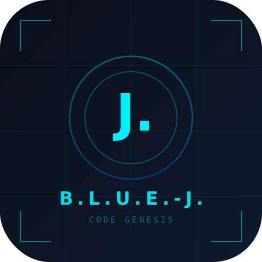

<<<<<<< Updated upstream
B.L.U.E .- J. Landing Page Copy
Headline
B.L.U.E .- J. is an Al-powered development environment that teaches you to build real software systems
through guided, interactive execution.
Product Description
It combines an Al tutor, a live coding environment, and a structured learning system into a single
platform. Users don't just learn programming concepts-they build working systems step by step with
Al assistance.
How It Works
Users interact with an Al assistant that guides them through a structured curriculum. Code is
generated, executed, and refined inside a unified interface that supports simulation, optimization, and
real-time feedback.
Key Value
The platform removes the gap between learning and building by embedding execution directly into the
learning process. This allows users to progress from basic programming to building functional Al
systems within one environment.
Closing
B.L.U.E .- J. is designed for learners and builders who want to move beyond tutorials and into real
system creation. It is a complete environment for learning, building, and deploying software with Al
assistance.
=======
<p align="center">
  
</p>

<h1 align="center">B.L.U.E.-J. Sovereign</h1>

<p align="center">
  <strong>Build · Learn · Utilize · Engineer</strong><br/>
  The AI that teaches you to build AI.
</p>

<p align="center">
  <a href="https://ai-coder-genesis--memoriesbymike3.replit.app/">Live Demo</a> ·
  <a href="#quick-start">Quick Start</a> ·
  <a href="#features">Features</a> ·
  <a href="SETUP-GUIDE.md">Setup Guide</a> ·
  <a href="SETUP-CI.md">CI/CD Guide</a>
</p>

<p align="center">
  
  
  
  
  
  
</p>

---

## What is B.L.U.E.-J.?

**B.L.U.E.-J.** (Build, Learn, Utilize, Engineer) is a sovereign AI-powered coding tutor and development environment. Chat with **J.** — your personal AI coding assistant — and progress from `Hello World` to building your own AI systems.

It's not just a chatbot. It's a complete platform: a live IDE, an adaptive curriculum, gamification, wellness tracking, and real code execution — all in one unified interface that runs on web, desktop, and mobile.

```
┌─────────────────────────────────────────────────┐
│  J. > Initializing B.L.U.E.-J. Sovereign v1.0  │
│  J. > Learner mode: ADVANCED                    │
│  J. > Hardware calibration: COMPLETE            │
│                                                 │
│  USER > Hey J., teach me to build a neural net  │
│  J. > Absolutely! Let's start with the          │
│       fundamentals. I'll walk you through       │
│       building one from scratch in Python...    │
└─────────────────────────────────────────────────┘
```

---

## How It Works

B.L.U.E.-J. follows a four-phase learning process — each letter in **B.L.U.E.** maps to a stage:

| Phase | Step | What Happens |
|:-----:|------|-------------|
| **B** | **Build** | Start building from day one. J. guides you through writing real code, calibrated to your skill level. |
| **L** | **Learn** | Chat with J. through the 6-phase curriculum. Ask questions, get explanations, and understand concepts deeply. |
| **U** | **Utilize** | Put your skills to work in the integrated IDE. Execute code live, debug with J.'s help, and build your portfolio. |
| **E** | **Engineer** | Engineer complete solutions. Export to GitHub, deploy as packages, and take your creations into the real world. |

---

## Features

### 🤖 AI Tutor (J.)
- **4 Learner Modes** — Kids, Beginner, Intermediate, Advanced
- **6-Phase Curriculum** — structured journey through 11 guided tasks
- **Adaptive Teaching** — J. calibrates to your skill level and hardware
- **Voice Chat** — always-on mic with auto-pause during responses

### 💻 Live Code Execution
- **Integrated IDE** — write, run, and debug code in-browser
- **Multi-Language** — Python, C++, JavaScript
- **Portfolio System** — save projects as you build them
- **Self-Correction** — AI-powered error detection with permission-gated fixes

### 🧠 Run AI Anywhere
- **Cloud API** — OpenAI-compatible endpoints
- **Local AI** — Ollama, LM Studio, llama.cpp with custom GGUF models
- **In-Browser AI** — WebLLM runs Phi-3.5-mini via WebGPU — fully offline
- **Smart Fallback** — auto-switches between cloud → local → browser

### 🎯 Gamification & Wellness
- **XP & Leveling** — earn XP for coding, completing goals, hitting milestones
- **Daily Goals** — 5 randomized missions per day across 6 categories
- **Achievements** — unlockable badges with rarity tiers
- **Streak Tracking** — maintain your daily coding streak
- **Wellness System** — hydration, stretches, eye rest, mood check-ins, Pomodoro breaks

### 📱 Run Everywhere
- **Web** — PWA, installable on any device
- **Desktop** — Electron (Windows `.exe`, Linux `.AppImage` / `.deb`)
- **Mobile** — Capacitor (Android `.apk`, iOS)
- **Offline** — full functionality without internet via WebLLM + service worker caching

---

## Quick Start

### Web (Recommended)

```bash
# Clone the repo
git clone https://github.com/s4ndm4n33-spec/B.L.U.E.-J.-PWA.git
cd B.L.U.E.-J.-PWA

# Install dependencies
npm install

# Start dev server
npm run dev
```

Open `http://localhost:5000` and start coding with J.

### Desktop (Electron)

```bash
npm run build
npm run electron:build
```

Produces installers in `dist/` — `.exe` (Windows), `.AppImage` + `.deb` (Linux).

### Mobile (Capacitor)

```bash
npm run build
npx cap sync
npx cap open android   # Opens Android Studio
```

See [SETUP-GUIDE.md](SETUP-GUIDE.md) for detailed instructions.

---

## Architecture

```
B.L.U.E.-J.-PWA/
├── src/
│   ├── components/        # UI components (ChatPanel, IdePanel, HUD, etc.)
│   ├── hooks/             # React hooks (chat, voice, audio, progress)
│   ├── lib/               # Core logic (AI providers, stores, offline AI)
│   ├── pages/             # Main simulator page
│   └── main.tsx           # Entry point + PWA registration
├── api/                   # Serverless API (Vercel / Express)
├── public/                # Static assets + PWA icons
├── .github/workflows/     # CI/CD — auto-builds for all platforms
├── electron-main.cjs      # Electron main process
├── capacitor.config.ts    # Capacitor mobile config
└── vite.config.ts         # Vite + PWA + Tailwind config
```

### Tech Stack

| Layer | Technology |
|-------|-----------|
| Frontend | React 19, TypeScript, Vite 6, Tailwind CSS |
| UI | Radix UI, Framer Motion, Lucide Icons, Recharts |
| State | Zustand |
| AI (Cloud) | OpenAI-compatible API |
| AI (Local) | Ollama, LM Studio, llama.cpp |
| AI (Browser) | WebLLM (Phi-3.5-mini via WebGPU) |
| Desktop | Electron + electron-builder + auto-updater |
| Mobile | Capacitor (Android / iOS) |
| PWA | vite-plugin-pwa + Workbox |
| CI/CD | GitHub Actions (Windows, Linux, Android builds) |
| Hosting | Vercel (serverless API) / Replit |

---

## CI/CD

Every push to `main` automatically builds:
- ✅ Windows — `.exe` installer + portable
- ✅ Linux — `.AppImage` + `.deb`
- ✅ Android — `.apk`

Tag a release (`v1.0.0`) to create a GitHub Release with all downloads attached.

See [SETUP-CI.md](SETUP-CI.md) for configuration details.

---

## Documentation

| Doc | Description |
|-----|-------------|
| [SETUP-GUIDE.md](SETUP-GUIDE.md) | Quick start, file changes, feature details |
| [SETUP-CI.md](SETUP-CI.md) | CI/CD pipeline setup and configuration |
| [PATCH-GUIDE.md](PATCH-GUIDE.md) | Patch notes — bug fixes, voice chat, wellness, self-correction |

---

## Links

- 🚀 **Live App** — [ai-coder-genesis--memoriesbymike3.replit.app](https://ai-coder-genesis--memoriesbymike3.replit.app/)
- 🌐 **Landing Page** — [bluej-site-97ccee23.viktor.space](https://bluej-site-97ccee23.viktor.space)

---

<p align="center">
  <strong>B.L.U.E.-J. Sovereign — AI Code Genesis Simulator</strong><br/>
  © 2026 B.L.U.E.-J. Project
</p>
>>>>>>> Stashed changes
